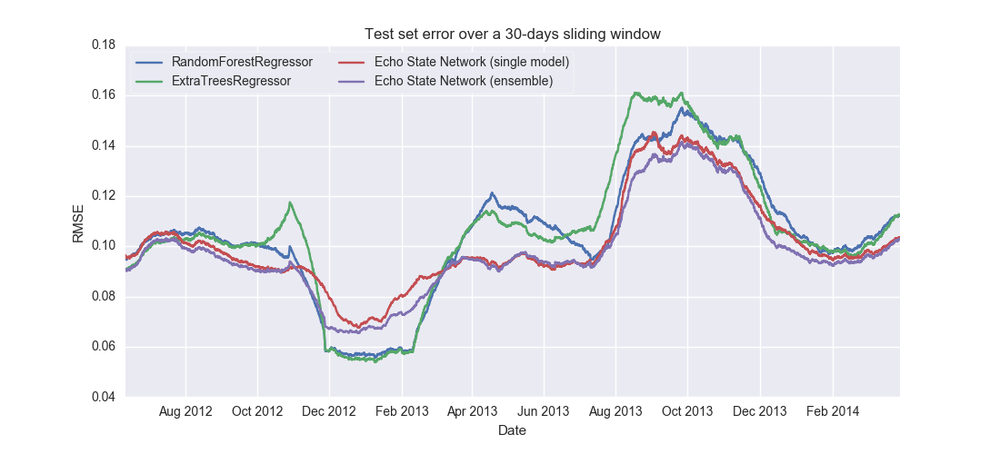
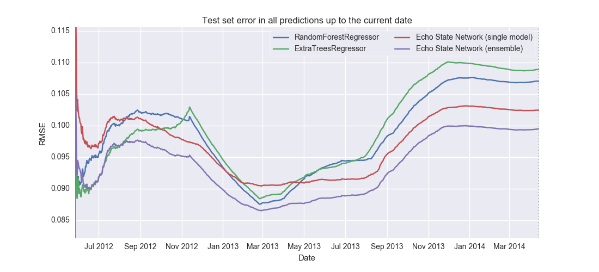

## Mars Express Power Challenge ##

https://kelvins.esa.int/mars-express-power-challenge/

> "The Mars Express Power Challenge focuses on the difficult problem of predicting the thermal power consumption. Three full Martian years of [Mars Express][Mars_Express] telemetry are made available and you are challenged to predict the thermal subsystem power consumption on the following Martian year."

### About ###

This repository contains all the work I did for the 'Mars Express Power' competition. It consists of two files:

 * [echo_state_networks.py](echo_state_networks.py)
 * [workbench.ipynb][nb]

My final submission reached a RMSE of 0.089078627464354 on the [public leaderboard][public leaderboard], and later a RMSE of 0.088395630359812905 on the [final leaderboard][final leaderboard], allowing me to rank in 5th place in the competition.
The file from that final submission is included here ([lfs_submission_5b__rebuilt.csv](lfs_submission_5b__rebuilt.csv)), and can be regenerated as well by running the code in the Jupyter Notebook.

### Features ###

See my post in the official forum ([here][end_post]) for an outline of the features I used.

### Models ###

I saw the competition as an opportunity to finally spend some time studying and implementing Echo State Networks (ESNs).
All my modelling effort was therefore spent on getting them, and them alone, to perform as well as possible.

See in the Jupyter Notebook the sections on "[Parameter sweeps][ns_params]" and "[Training ensembles][ns_ensem]", for descriptions of steps taken to understand their behaviour, and to train them as accurately as possible.

### References ###

1. Jaeger, H. (2007). [Echo state network][ESN_schol]. *Scholarpedia*, 2(9), 2330.
2. Lukoševičius, M. (2012). [A practical guide to applying echo state networks][ESN_guide]. In *Neural networks: Tricks of the trade* (pp. 659-686). Springer Berlin Heidelberg.
3. Principe, J. C., & Chen, B. (2015). [Universal approximation with convex optimization: Gimmick or reality?][CULM] *IEEE Computational Intelligence Magazine,* 10(2), 68-77.

### Dependencies ###

The code shared here was written in Python 3 (3.4.4). It has the following dependencies:
* numpy, scipy, matplotlib, seaborn, pandas, scikit-learn, and tqdm.

[Mars_Express]: https://en.wikipedia.org/wiki/Mars_Express
[public leaderboard]: https://kelvins.esa.int/mars-express-power-challenge/leaderboard/
[final leaderboard]: https://kelvins.esa.int/mars-express-power-challenge/results/

[end_post]: https://kelvins.esa.int/mars-express-power-challenge/discussion/110/#c115

[ESN_schol]: http://www.scholarpedia.org/article/Echo_state_network
[ESN_guide]: http://minds.jacobs-university.de/sites/default/files/uploads/papers/PracticalESN.pdf
[CULM]: http://dx.doi.org/10.1109/MCI.2015.2405352

[nb]: http://nbviewer.jupyter.org/github/lfsimoes/mars_express__esn/blob/master/workbench.ipynb
[ns_params]: http://nbviewer.jupyter.org/github/lfsimoes/mars_express__esn/blob/master/workbench.ipynb#Parameter-sweep
[ns_ensem]: nbviewer.jupyter.org/github/lfsimoes/mars_express__esn/blob/master/workbench.ipynb#Training-ensembles
